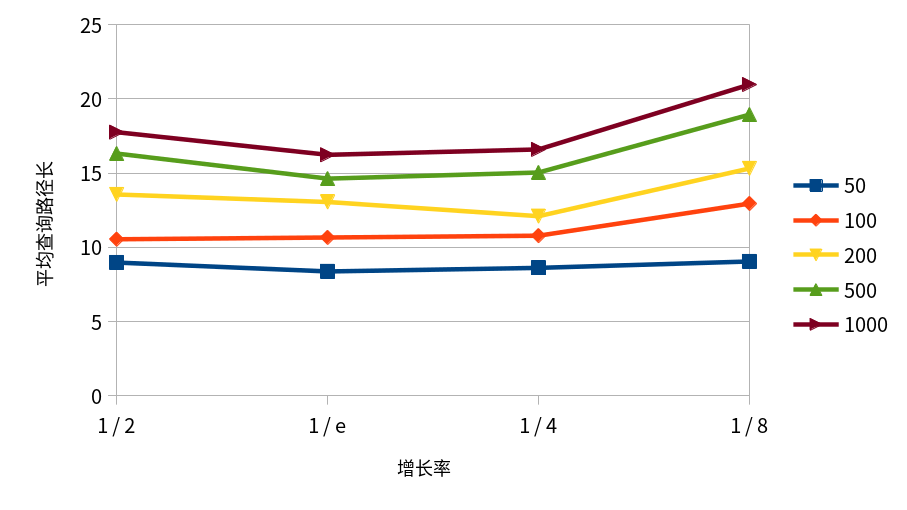

<!-- 起始时间10:43 -->
# HW1 Skiplist

## 对跳表的插⼊、搜索等关键代码的说明

搜索的代码：在每层内向右搜索，如果右侧为空或者右侧键大于查询值，则向下一层。

插入的代码：用一个`std::vector`保存查找路径，用`std::geometric_distribution`生成节点层高，在查询路径上各层链表内插入新产生的节点。

（另：代码在 `hw1-code` 下）

## 要求的作图和相应分析
要求折线图如下。

可见大体上符合理论情况，在增长率为1/e处平均搜索路径最短。在元素个数为100处1/e略差于1/2，但是应该认为是误差范围之内。

<!-- 结束时间11:39 -->
