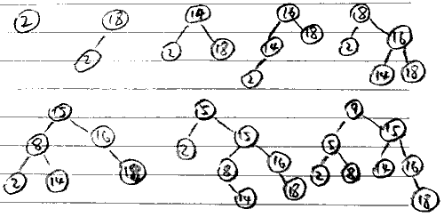
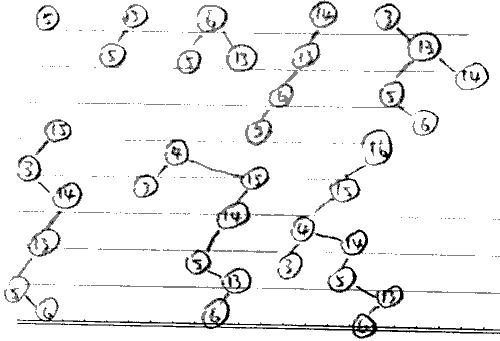

<!-- 起始时间13:24 -->
# HW3 Splay小练习

## 实践：插入操作

## 小问答

### 你怎么理解splay的均摊时间复杂度？
虽然单次操作不能保证对数时间内完成，但操作次数多了后平均每次操作的时间复杂度是对数复杂度。

例如上面的第二个splay，虽然树很高，但只要再插入一个7，在一次解决线性复杂度的调整后，树形会自调整得规则许多。

### 对于实践环节的两个插入序列，它们最后产生的树的形态有什么区别？从插入序列来看，原因是什么？
第1个树形态比较均衡，因为其插入序列比较随机，每次调整次数也较平衡。

第2个树形态很不均衡，因为插入序列构造时有意把大数小数交替，每次调整很浅，深层的树得不到调整，被逐渐向下旋转，加深树深。
<!-- 结束时间13:51 -->