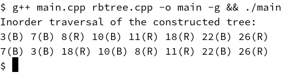

<!-- 起始时间14:10 -->
# HW5 RBTree实现

（注：代码在 `hw5-code` 下）

## 代码正确性
### 画出插入后的红黑树
```plaintext
  7(B) --------------> 18(R)
   /               /--/    \
  /               /         \
3(B) 8(R) <- 10(B) -> 11(R)  22(B) -> 26(R)
```

### 程序结果截图


## 解释删除后采取的失衡恢复操作
（不做要求。实现方式不唯一）

把删除点和其后继交换后删除后继。如果删除的是红点则无需调整，否则需要调整。假设失衡时，X子树高度缺1。

1. 如果X是红点，则把X染黑。
2. 如果X是黑点
	1. 如果X的兄弟是红，则X的父节点必黑，结构如下（或其镜像同理）
		```plaintext
		 |
		 Y(B) -> Z(R)
		/       / \
		|    U(B)   V
		|
		X(B)
		```
		则调整为
		```plaintext
			     |
		 Y(R) <- Z(B)
		/   \     \
		|  U(B)    V
		|
		X
		```
		然后继续调整X。
	2. 如果X的兄弟Z是黑
		1. 如果Z的靠近X一侧孩子是红，结构如下（或其镜像同理）
			```plaintext
			 --- Y(B/R)---
			/             \
			|       U(R)<-Z(B)->[V(R)]
			|      / \     \
			X(B)  I   J   [V(B)]
			```
			则调整为
			```plaintext
			   U(B/R)
			 /        \
			 Y(B)     Z(B)->[V(R)]
			/   \    / \
			X(B) I  J [V(B)]
			```
		2. 如果Z的靠近X一侧孩子是黑，结构如下（或其镜像同理）
			```plaintext
			 |
			 Y(B/R)
			/      \
			|      Z(B) -> [V(R)]
			|      /   \
			X(B)  U(B)  [V(B)]
			```
			则调整为
			```plaintext
					  |
			  Y(R) <- Z(B) -> [V(R)]
			 /   \      \
			X(B)  U(B)  [V(B)]
			```
			然后如果Y原来是黑，则继续调整Z。

## 顺序、乱序结果统计

测试|染色次数|旋转次数
---|----|---
顺序|49877|9976
乱序|23064|5815
乱序|23222|5843
乱序|23344|5867
乱序|23188|5879
乱序|23123|5822
乱序|23024|5791
乱序|23110|5800
乱序|23183|5841
乱序|23044|5659
乱序|23078|5786

结论同hw4：从数据结构角度看，顺序插入导致插入集中在边缘值附近，则那边的树会偏深，染色、旋转等失衡事件会发生地更集中；而随机插入则会把插入值分摊到各处，让染色、旋转等失衡事件发生得更分散。
<!-- 结束时间15:05 -->
